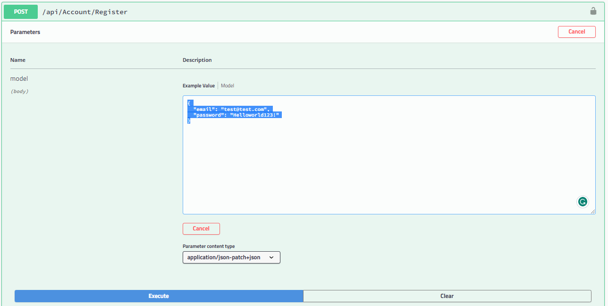
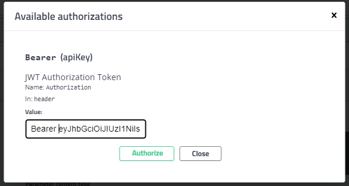
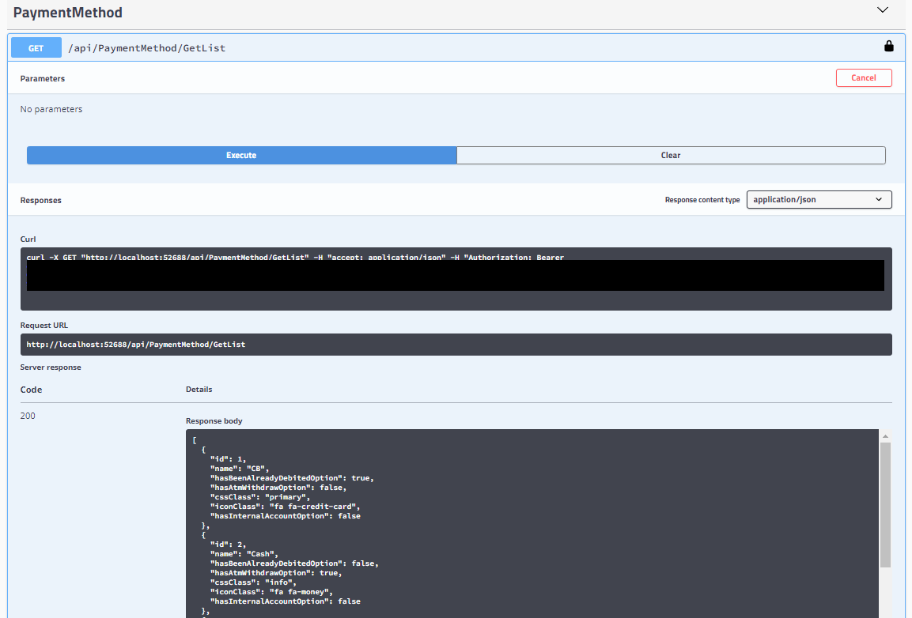
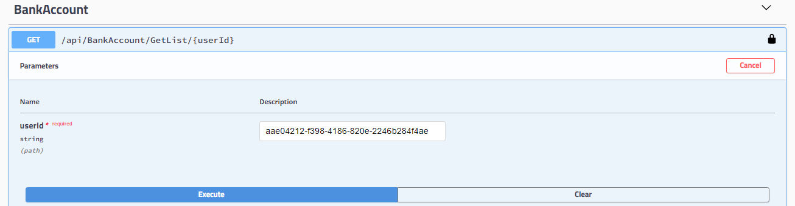

# PFM API

This API has currently a monolithic architecture.  

## Getting Started

### Debug the API

Open the solution and make sure you set PFM.Api as the start up project. 

The API should open in the browser directly: http://localhost:52688/swagger/index.html.

The application can be found [here](http://localhost/#/events?filter=Application%20%3D%20'PFM.Api').

### Test the API

All actions require to be authenticated. 

Start by registering a new user:

```json
{
  "email": "test@test.com",
  "password": "Helloworld123!"
}
```



The response returned by this call is a token. 

Click on the "Authorize" button at the top of the page, enter "Bearer ", copy the token and Authorize:



You can now access the actions, for instance, Payment methods are part of the seed data:



Some actions require a user-id that can be found when Login. 



### Deploy app as ECS service (localstack PRO setup)

This project uses [Localstack Pro](https://localstack.cloud/pricing/) to run the terraform code against a mock AWS infrastructure in docker. 

To use the localstack, in the PFM.Infra/configs:
1. Copy the `.env-example` and rename to `.env`. This file will contain sensitive data for local development and is ignored by git.  
2. Run `sh run-locally-with-localstack-pro.sh` to start localstack and deploy the iac in this local environment. It may takes a few minutes to setup. (Repository: 1 resource, network: 32 resources, service: 15 resources).
3. Run docker push 

```shell
docker build . -f Dockerfile -t "localhost.localstack.cloud:4510/pfm-api:latest" --build-arg GH_PKG_TOKEN_ARG=<token>
docker push "localhost.localstack.cloud:4510/pfm-api:latest"
```

4. Once setup, you can run aws commands:

```shell
# List of running tasks on the cluster
aws ecs list-tasks --cluster pfm-api --endpoint-url http://localhost:4566 --region eu-west-2

# Get running tasks status
aws ecs describe-tasks --tasks "arn:aws:ecs:eu-west-2:000000000000:task/pfm-api/54953595-5652-4550-860f-a5cd5b60a055" --cluster pfm-api --endpoint-url http://localhost:4566 --region eu-west-2

# Get service metadata
aws ecs describe-services --services pfm-api --cluster pfm-api --endpoint-url http://localhost:4566 --region eu-west-2

# List the log groups
aws logs describe-log-groups --endpoint-url http://localhost:4566 --region eu-west-2

# List the log stream of the log group
aws logs describe-log-streams --log-group-name "/aws/ecs/pfm-api" --endpoint-url http://localhost:4566 --region eu-west-2
``` 