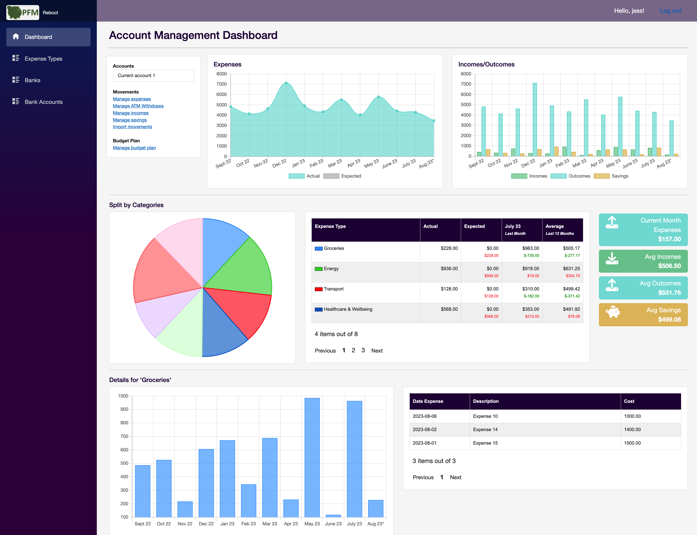

# Personal Finance Manager

PFM is a web application to manage your personal finance and visualise your expenses in a dashboard. 



The detailed specifications are detailed [here](https://github.com/JM89/personalfinancemanager/wiki/Functional-Requirements)

## General Architecture & Technologies

### Overview


The evolution of the architecture is documented in this wiki page: [System Architecture Evolution](https://github.com/JM89/personalfinancemanager/wiki/System-Architecture-Evolution). 

## Getting Started

### Pre-requisites

#### Tools

You will need the following tools installed on your development machine:
[x] Docker
[x] .NET 7
[x] `jq` command line

#### GitHub Package Access

To run from local machine, you will need a GitHub token to access the private GitHub packages. 

In the `./PFM.Infra/configs`, you will find an .env-example file. If you copy this file and name it `.env` in the same location, the `run-locally.sh` script will pick it up automatically. 

:warning: This file is part of gitignore. It will contains sensitive data, do not commit the .env file. 

#### Local keycloak secrets

To simplify the setup, the secrets for Keycloak have been hard-coded. In a normal setup, this would have to be stored in a secured fashion. 

|Property|Value|Description|
|---|---|---|
|admin|`SecurityMatters12456!`|Administrator Password|
|jess|`SecurityMatters!123`|PFM Default User|
|pfm|`RTkyA3RNh4cHHhS8ftXe17WOQu9a0Jjd`|App client for PFM Website|
|pfm-bank-account-updater|`RTkyA3RNh4cHHhS8ftXe17WOQu9a0Jje`|Service account for Bank Account Updater|
|pfm-mvt-aggregator|`RTkyA3RNh4cHHhS8ftXe17WOQu9a0Jjf`|Service account for Movement Aggregator|

#### Shared infrastructure

Some infrastructure resources are shared accross different projects (e.g. SQL server, SEQ, AWS), some are dedicated to each apps (e.g. creation DB, a SQS queue). 

The shared resources available in the PFM.Infra folder, contains the shared resources:

|Resources|Description|Docker|Debug Mode|Internal Docker|
|---|---|---|---|---|
|SEQ|Logging|[Log Ingest](http://localhost:5341)<br/>[UI](http://localhost:80)|[Log Ingest](http://localhost:5341)<br/>[UI](http://localhost:80)|[Log Ingest](http://seq:5341)|
|SQL Server|a single container is used for several isolated DB, to reduce the setup time, space and memory in local machine. |localhost,1433|localhost,1433|db-server,1433|
|Localstack|Localstack for mocking AWS resources.|[Endpoints](http://localhost:4566)|[Endpoints](http://localhost:4566)|[Endpoints](http://localstack:4566)|
|EventStore|Publishing/consuming events and auditing.|[Endpoints](http://localhost:2113)|[Endpoints](http://localhost:2113/)|[Endpoints](http://eventstore:2113)|
|Prometheus|Application Metrics collector|[Endpoints](http://localhost:9090)|[Endpoints](http://localhost:9090)|[Endpoints](http://prometheus:9090)|
|Grafana|Monitoring Dashboard tool, configured to read from Prometheus|[Endpoints](http://localhost:3000)|[Endpoints](http://localhost:3000)|[Endpoints](http://grafana:3000)|
|Keycloak|Authentication & Authorisation server. The keycloak-init folder will setup the minimum user & clients. |[Endpoints](http://localhost:8080)|[Endpoints](http://localhost:8080)|[Endpoints](http://keycloak:8080)|

### Starting the backend services & dependencies

You can start all the backend services and dependencies using the command: 

```shell
sh ./run-locally.sh
```

From there, you can start the main website from Visual Studio. 

To speed up the development of the front-end part, I used an in-memory storage instead of calling the PFM.API. The flag is called UsePfmApi. All configurations can be found here:

|Property|Default Value|Configration|
|---|---|---|
|`AuthOptions:Authority`|http://localhost:8080/realms/pfm|SSO Authority|
|`AuthOptions:ClientId`|pfm|PFM Client ID|
|`AuthOptions:ClientId`|RTkyA3RNh4cHHhS8ftXe17WOQu9a0Jjd|PFM Client Secret|
|`UsePfmApi`|false|If disabled, use in-memory storage|
|`PfmApi:EndpointUrl`|https://localhost:4431/|PFM API Docker Endpoint.|
|`ApplicationSettings:UseRemoteStorageForBankIcons`|false|If disabled, use local system. We need to put metrics to measure latency and optimise before re-enabling this. |
|`ApplicationSettings:BankIconLocation`|./wwwroot/Resources/bank_icons|If UseRemoteStorageForBankIcons is enabled, use the s3 bucket name for the location: pfm-website-bank-icons|
|`ApplicationSettings:AwsRegion`|eu-west-2|If UseRemoteStorageForBankIcons is enabled, s3 bucket AWS region (localstack init setup)|
|`ApplicationSettings:AwsEndpointUrl`|http://localhost:4566|If UseRemoteStorageForBankIcons is enabled, s3 bucket AWS endpoint url (localstack init setup)|

The API URLs can be found here:

|Resources|Docker|Debug Mode|Internal Docker|
|---|---|---|---|
|App - PFM.Api|[Api Endpoints](https://localhost:4431/api)<br/>[Swagger](https://localhost:4431/swagger/index.html)|[Api Endpoints](https://localhost:7098/api)<br/>[Swagger](https://localhost:4431/swagger/index.html)|[Api Endpoints](https://pfm-api:4431/api)|
|App - PFM.Bank.Api|[Api Endpoints](https://localhost:7099/api)<br/>[Swagger](https://localhost:7099/swagger/index.html)|[Api Endpoints](https://localhost:50001/api)<br/>[Swagger](http://localhost:50001/swagger/index.html)|[Api Endpoints](http://pfm-bank-api:50001/api)|

### Debug the APIs

All APIs uses Swagger. You can generate a token using the user created during the initialisation script: 

```shell
curl -v -L -X POST "http://localhost:8080/realms/pfm/protocol/openid-connect/token" \
-H 'Content-Type: application/x-www-form-urlencoded' \
--data-urlencode 'client_id=pfm' \
--data-urlencode 'grant_type=password' \
--data-urlencode 'client_secret=RTkyA3RNh4cHHhS8ftXe17WOQu9a0Jjd' \
--data-urlencode 'scope=openid' \
--data-urlencode 'username=jess' \
--data-urlencode 'password=SecurityMatters!123' | jq .access_token
```

The bearer token generated can then be used in Swagger.

Click on the "Authorize" button at the top of the page, enter "Bearer ", copy the token and Authorize:


You can now access the actions.

### Generate some data

Some features of the system are only demo-able if there is some data. To generate some data, run the following script:

```shell
sh ./generate-data.sh
```
