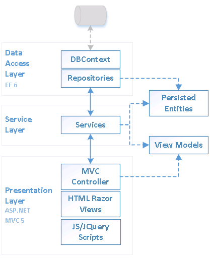
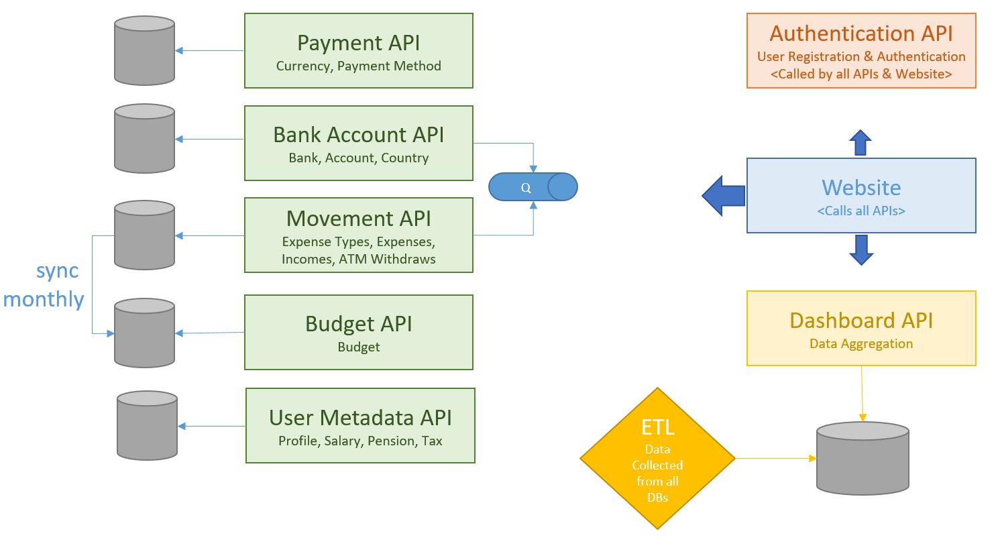

# Personal Finance Manager

PFM is a web application to manage your personal finance and visualise your expenses in a dashboard.


The main features are: 
* Management of bank accounts
* Dashboard of expenses, incomes & savings
* Import of historic movements using CSV files

The detailed specifications are detailed [here](https://github.com/JM89/personalfinancemanager/wiki/Functional-Requirements)

## General Architecture & Technologies

This project is made of 4 solutions:

* **PFM.Api**: ASP.NET Core 2.0 API, intented to run as a self-hosted API (Windows Service).
* **PFM.Website**: ASP.NET MVC Website, which would run on IIS
* **PFM.CommonLibraries**: NET Standard 2.0 Library for sharing common code between the two main solutions.
* **PFM.IntegrationTests**: Automation test solution, runnable by a CI tool



### Plan for PFM Reboot



|Project| Status | Integrated with website |
|---|---|:-:|
| Payment API | Code migrated & smoke-tested | ❌ |
| Bank Account API | Code migrated & smoke-tested | ❌ |
| Bank Account Updater | In Progress | ❌ |
| Movement API | Code migrated & smoke-tested | ❌ |
| Budget API | Not Started | ❌ |
| Budget Synchroniser | Not Started | ❌ |
| User Metadata API | Code migrated & smoke-tested | ❌ |
| Authentication API | Tests in progress | ❌ |
| Dashboard API | Not Started | ❌ |
| Dashboard ETL | Not Started | ❌ |

## Getting Started

### Shared and specific infrastructure

Some infrastructure resources are shared accross different projects (e.g. SQL server, SEQ, AWS), some are specifics to each apps (e.g. creation DB, a SQS queue). The resources available in the PFM.Infra folder, contains the shared resources. 

It includes:
- [x] SQL Server instance: a single container is used for several isolated DB, to reduce the setup time, space and memory in local machine. 
- [x] SEQ for logging purpose
- [x] Localstack for AWS resources.

To get started, run the following command:

```shell
sh ./run-locally.sh
```

The command will also start all the application-specific docker-compose files supported: 
- [x] PFM.API database initialization script (db, security, schema, seed data)

### Debug the application

Check the documentation [here](./PFM.Api/README.md).

### Start using the website

1. First "Register", then login with this new user account. 
2. Set User Profile (top menu) 
3. Configure your data: Country, Currency, Expense Types, Bank and Accounts (Configuration menu). 
4. Start creating movements from the Account Management dashboard screen
