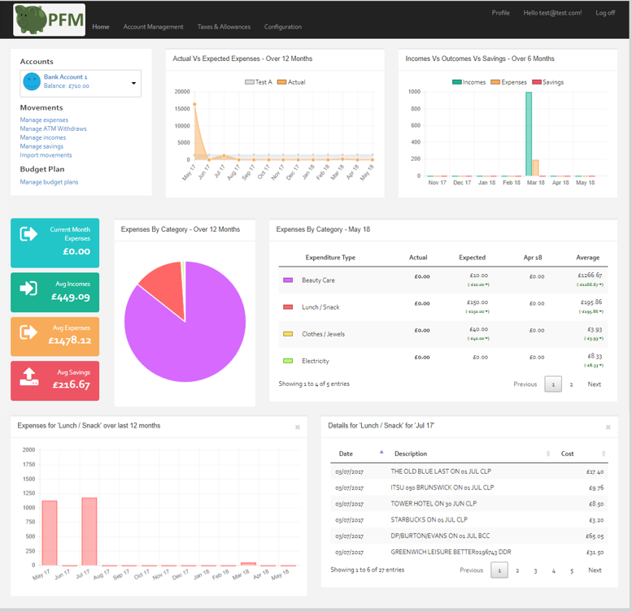

# Personal Finance Manager

PFM is a web application to manage your personal finance and visualise your expenses in a dashboard.



The main features are: 
* Management of bank accounts
* Dashboard of expenses, incomes & savings
* Import of historic movements using CSV files

The detailed specifications are detailed [here](https://github.com/JM89/personalfinancemanager/wiki/Functional-Requirements)

## General Architecture & Technologies

### Overview


The evolution of the architecture is documented in this wiki page: [System Architecture Evolution](https://github.com/JM89/personalfinancemanager/wiki/System-Architecture-Evolution). 

## Getting Started

### Secrets

To run from local machine, you will need a GitHub token to access the private GitHub packages. 

In the `./PFM.Infra/configs`, you will find an .env-example file. If you copy this file and name it `.env` in the same location, the `run-locally.sh` script will pick it up automatically. 

:warning: This file is part of gitignore. It will contains sensitive data, do not commit the .env file. 

### Shared and specific infrastructure

Some infrastructure resources are shared accross different projects (e.g. SQL server, SEQ, AWS), some are specifics to each apps (e.g. creation DB, a SQS queue). The resources available in the PFM.Infra folder, contains the shared resources. 

It includes:
- [x] SQL Server instance: a single container is used for several isolated DB, to reduce the setup time, space and memory in local machine. 
- [x] SEQ for logging purpose.
- [x] Localstack for AWS resources.
- [x] EventStore for publishing/consuming events and auditing.

To get started, run the following command:

```shell
sh ./run-locally.sh
```

The command will also start all the application-specific docker-compose files.

### Start using the website

1. First "Register", then login with this new user account. 
2. Set User Profile (top menu) 
3. Configure your data: Expense Types, Bank and Accounts (Configuration menu). 
4. Start creating movements from the Account Management dashboard screen

## Useful Links

|Resources|Docker|Debug Mode|Internal Docker|Documentation|
|---|---|---|---|---|
|App - PFM.Website|:heavy_minus_sign:|[Website](http://localhost:54401)|:heavy_minus_sign:|:heavy_minus_sign:|
|App - PFM.Api|[Api Endpoints](https://localhost:4431/api)<br/>[Swagger](https://localhost:4431/swagger/index.html)|[Api Endpoints](https://localhost:7098/api)<br/>[Swagger](https://localhost:7098/swagger/index.html)|[Api Endpoints](https://pfm-api:4431/api)|[Link](./PFM.Api/README.md)|
|App - PFM.Auth.Api|[Api Endpoints](http://localhost:5000)|[Api Endpoints](http://localhost:4000)|[Api Endpoints](http://pfm-auth-api:5000)|[Link](./PFM.Auth.Api/README.md)||
|App - PFM.Bank.Api|[Api Endpoints](https://localhost:7099/api)<br/>[Swagger](https://localhost:7099/swagger/index.html)|[Api Endpoints](https://localhost:50001/api)<br/>[Swagger](http://localhost:50001/swagger/index.html)|[Api Endpoints](http://pfm-bank-api:50001/api)|[Link](./PFM.Bank.Api/README.md)|
|App - PFM.Bank.Updater|:heavy_minus_sign:|:heavy_minus_sign:|:heavy_minus_sign:|[Link](./PFM.Bank.Updater/README.md)|
|SEQ|[Log Ingest](http://localhost:5341)<br/>[UI](http://localhost:80)|[Log Ingest](http://localhost:5341)<br/>[UI](http://localhost:80)|[Log Ingest](http://seq:5341)||
|SQL Server|localhost,1433|localhost,1433|db-server,1433||
|Localstack|[Endpoints](http://localhost:4566)|[Endpoints](http://localhost:4566)|[Endpoints](http://localstack:4566)||
|EventStore|[Endpoints](http://localhost:2113)|[Endpoints](http://localhost:2113/)|[Endpoints](http://eventstore:2113)||
