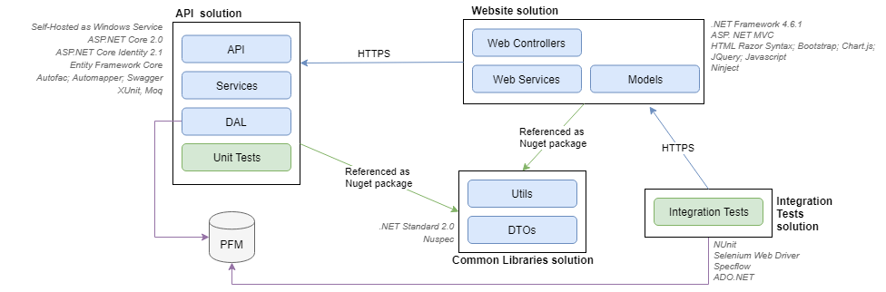
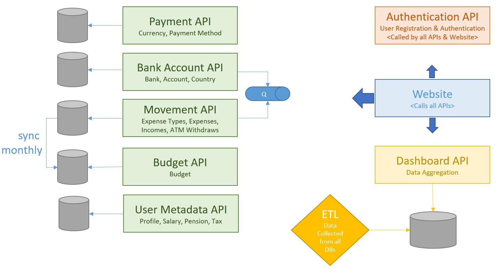
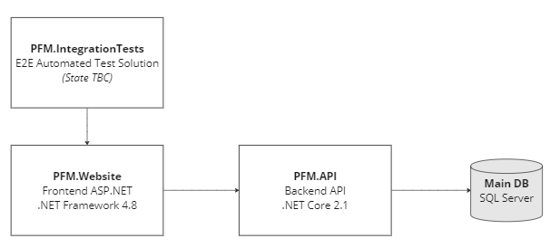
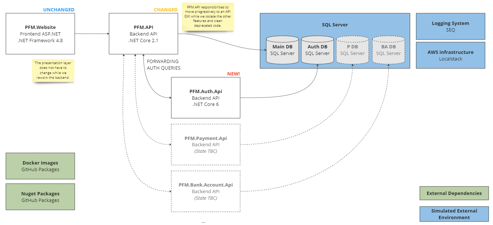

# System Architecture Evolution

## General Architecture & Technologies

### Origin 

This project was originally made of 4 solutions:

* **PFM.Api**: ASP.NET Core 2.0 API, intended to run as a self-hosted API (Windows Service).
* **PFM.Website**: ASP.NET MVC Website, which would run on IIS
* **PFM.CommonLibraries**: NET Standard 2.0 Library for sharing common code between the two main solutions.
* **PFM.IntegrationTests**: Automation test solution, runnable by a CI tool

### Plan for PFM Reboot (Jun 20, 2020)

| Project              | Status                       | Integrated with website |
| -------------------- | ---------------------------- | :---------------------: |
| Payment API          | Code migrated & smoke-tested |            ❌            |
| Bank Account API     | Code migrated & smoke-tested |            ❌            |
| Bank Account Updater | In Progress                  |            ❌            |
| Movement API         | Code migrated & smoke-tested |            ❌            |
| Budget API           | Not Started                  |            ❌            |
| Budget Synchroniser  | Not Started                  |            ❌            |
| User Metadata API    | Code migrated & smoke-tested |            ❌            |
| Authentication API   | Tests in progress            |            ❌            |
| Dashboard API        | Not Started                  |            ❌            |
| Dashboard ETL        | Not Started                  |            ❌            |

### Phased Approach Refactoring (April 14, 2023)

The system is greatly outdated. As the previous attempt to rework the whole system was not successful, an iterative approach is adopted for this new phase of development.

At the start of the phase, the simplified architecture is:

The plan is to consolidate the existing setup to reduce the risk of regressions, and to integrate with the PFM authentication API:

**Actions:**
- [x] Upgrade PFM.Api to .NET Core 2.1
- [x] Upgrade PFM.Website to .NET Framework 4.8
- [x] Add CI Support (GitHub Action)
- [x] Simplify local setup/development using SQL Server (Docker)
- [x] Build & Publish API.Contracts (GitHub Packages)
- [x] Support SEQ Logging in PFM.Api
- [x] PFM.Auth.API code import in the PFM repository
- [x] PFM.Auth.API Auth DB setup
- [x] Support SEQ Logging in PFM.Auth.API
- [x] PFM.API forwarding Login/Register requests to the PFM.Auth.Api

### Split of the Bank Account Updater service (May 5, 2023)

#### Diagrams

- <a href="https://github.com/JM89/personalfinancemanager/blob/v4.0.0/Documentation/Pictures/Architecture/Architecture-C4-SystemContext.png">System Context v4.0.0</a>
- <a href="https://github.com/JM89/personalfinancemanager/blob/v4.0.0/Documentation/Pictures/Architecture/Architecture-C4-Container.png">Container v4.0.0</a>

#### Follow up

| Project                | Status                          | Integrated with website |
| ---------------------- | ------------------------------- | :---------------------: |
| Bank Account API       | Completed                       |            ✔️            |
| Bank Account Updater   | Completed                       |            ✔️            |
| Movement API           | Not Started                     |            ❌            |
| Budget API             | Not Started                     |            ❌            |
| User Metadata API      | Not Started                     |            ❌            |
| Authentication API     | To replace with an IDp Provider |            ⚠️            |
| API Gateway / Main API | Rework In Progress              |            ⚠️            |
| Movement Aggregator    | Not Started                     |            ❌            |

### PFM Website Reboot (August 17, 2023)

Updates:
- [Issue #68 ](https://github.com/JM89/personalfinancemanager/issues/68): Replacement of the auth server by using an external (dockerised) IdP instead of the PFM Auth API. PFM Auth API is now decommissioned.
- Mouvement Summary is now coming from the aggregation service instead of computed on the fly for speed reasons. Possible delays in data propagation are acceptable in this specific scenario.
- PFM Website had multiple limitations and migrating to .NET Core and Blazor would require major changes. As such, PFM Website Reboot is created to replace the front-end application. Most of the business features will be re-implemented before merging, except the budget (https://github.com/JM89/personalfinancemanager/issues/111) and import of movements (https://github.com/JM89/personalfinancemanager/issues/112). Other changes include:
    - Keycloak service will be used for SSO
    - Refit will be used to access the PFM API for reducing code.
    - A in-memory layer will be provided to mock the PFM API so we can develop front-end features in isolation.
    - The bank icons are stored in a s3 bucket (localstack) instead of file system.

#### Diagrams

- <a href="https://github.com/JM89/personalfinancemanager/blob/v5.1.0/Documentation/Pictures/Architecture/Architecture-C4-SystemContext.png">System Context vv5.1.0</a>
- <a href="https://github.com/JM89/personalfinancemanager/blob/v5.1.0/Documentation/Pictures/Architecture/Architecture-C4-Container.png">Container v5.1.0</a>

#### Follow up

| Project                | Status               | Integrated with website |
| ---------------------- | -------------------- | :---------------------: |
| Bank Account API       | Completed            |            ✔️            |
| Bank Account Updater   | Completed            |            ✔️            |
| Movement API           | Not Started          |            ❌            |
| Budget API             | Not Started          |            ❌            |
| User Metadata API      | Not Started          |            ❌            |
| Authentication API     | Replaced by Keycloak |            ✔️            |
| API Gateway / Main API | Rework In Progress   |            ⚠️            |
| Movement Aggregator    | Completed            |            ✔️            |
