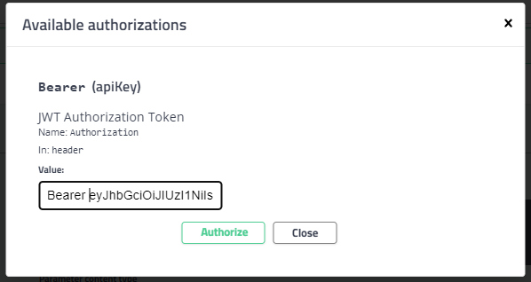

# Getting Started


### Pre-requisites

#### Tools

You will need the following tools installed on your development machine:
- [x] Docker
- [x] .NET 9
- [x] `jq` command line
- [x] `tilt` command line

#### Changes on hosts file

Add the following entries to your hosts file:

```sh
sudo sh -c 'echo 127.0.0.1 keycloak >> /etc/hosts'
```

#### GitHub Package Access

To run from local machine, you will need a GitHub token to access the private GitHub packages. 

In the `./PFM.Infra/configs`, you will find an .env-example file. If you copy this file and name it `.env` in the same location, the `tilt up` script will pick it up automatically. 

:warning: This file is part of gitignore. It will contains sensitive data, do not commit the .env file. 

#### Local keycloak secrets

To simplify the setup, the secrets for Keycloak have been hard-coded. In a normal setup, this would have to be stored in a secured fashion. 

| Property                 | Value                              | Description                              |
| ------------------------ | ---------------------------------- | ---------------------------------------- |
| admin                    | `SecurityMatters12456!`            | Administrator Password                   |
| jess                     | `SecurityMatters!123`              | PFM Default User                         |
| pfm                      | `RTkyA3RNh4cHHhS8ftXe17WOQu9a0Jjd` | App client for PFM Website               |
| pfm-bank-account-updater | `RTkyA3RNh4cHHhS8ftXe17WOQu9a0Jje` | Service account for Bank Account Updater |
| pfm-mvt-aggregator       | `RTkyA3RNh4cHHhS8ftXe17WOQu9a0Jjf` | Service account for Movement Aggregator  |

#### Shared infrastructure

Some infrastructure resources are shared accross different projects (e.g. SQL server, SEQ, AWS), some are dedicated to each apps (e.g. creation DB, a SQS queue). 

The shared resources available in the PFM.Infra folder, contains the shared resources:

| Resources        | Description                                                                                                      | Docker                                                                                       | Debug Mode                                                        | Internal Docker                     |
| ---------------- | ---------------------------------------------------------------------------------------------------------------- | -------------------------------------------------------------------------------------------- | ----------------------------------------------------------------- | ----------------------------------- |
| SEQ              | Logging                                                                                                          | [Log Ingest](http://localhost:5341)<br/>[UI](http://localhost:80)                            | [Log Ingest](http://localhost:5341)<br/>[UI](http://localhost:80) | [Log Ingest](http://seq:5341)       |
| SQL Server       | a single container is used for several isolated DB, to reduce the setup time, space and memory in local machine. | localhost,1433                                                                               | localhost,1433                                                    | db-server,1433                      |
| Localstack       | Localstack for mocking AWS resources.                                                                            | [Endpoints](http://localhost:4566)                                                           | [Endpoints](http://localhost:4566)                                | [Endpoints](http://localstack:4566) |
| EventStore       | Publishing/consuming events and auditing.                                                                        | [Endpoints](http://localhost:2113)                                                           | [Endpoints](http://localhost:2113/)                               | [Endpoints](http://eventstore:2113) |
| Keycloak         | Authentication & Authorisation server. The keycloak-init folder will setup the minimum user & clients.           | [Endpoints](http://localhost:8080)                                                           | [Endpoints](http://localhost:8080)                                | [Endpoints](http://keycloak:8080)   |
| MySql Server     | a single container is used for several isolated DB, to reduce the setup time, space and memory in local machine. | localhost,3306                                                                               | localhost,3306                                                    | mysql-db-server,3306                |
| Aspire Dashboard | Monitoring dashboard for logging, metrics and tracing.                                                           | [Dashboard](http://localhost:18888/structuredlogs) <br/> Telemetry Ingestion: localhost:4317 |                                                                   |                                     |

### Starting the backend services & dependencies

You can start all the backend services and dependencies using the command: 

```shell
tilt up
```

From there, you can start the main website from Visual Studio. 

To speed up the development of the front-end part, I used an in-memory storage instead of calling the PFM.API. The flag is called UsePfmApi. All configurations can be found here:

#### Configurations

##### External Settings Configs

Configuration Sections: `ApplicationSettings:AuthOptions`

| Property    | Default Value                    | Configration      |
| ----------- | -------------------------------- | ----------------- |
| `Authority` | http://localhost:8080/realms/pfm | SSO Authority     |
| `ClientId`  | pfm                              | PFM Client ID     |
| `ClientId`  | RTkyA3RNh4cHHhS8ftXe17WOQu9a0Jjd | PFM Client Secret |

##### External Settings Configs

Configuration Sections: `ApplicationSettings:ExternalServiceSettings`

| Property                            | Default Value                  | Configration                                                                                                   |
| ----------------------------------- | ------------------------------ | -------------------------------------------------------------------------------------------------------------- |
| `PfmApiOptions:Enabled`             | false                          | If disabled, use in-memory storage                                                                             |
| `PfmApiOptions:EndpointUrl`         | https://localhost:4431/        | PFM API Docker Endpoint.                                                                                       |
| `BankIconSettings:UseRemoteStorage` | false                          | If disabled, use local system. We need to put metrics to measure latency and optimise before re-enabling this. |
| `BankIconSettings:Location`         | ./wwwroot/Resources/bank_icons | If UseRemoteStorage is enabled, use the s3 bucket name for the location: pfm-website-bank-icons                |
| `AwsRegion`                         | eu-west-2                      | If UseRemoteStorage is enabled, s3 bucket AWS region (localstack init setup)                                   |
| `AwsEndpointUrl`                    | http://localhost:4566          | If UseRemoteStorage is enabled, s3 bucket AWS endpoint url (localstack init setup)                             |

The API URLs can be found here:

| Resources          | Docker                                                                                               | Debug Mode                                                                                             | Internal Docker                                |
| ------------------ | ---------------------------------------------------------------------------------------------------- | ------------------------------------------------------------------------------------------------------ | ---------------------------------------------- |
| App - PFM.Api      | [Api Endpoints](https://localhost:4431/api)<br/>[Swagger](https://localhost:4431/swagger/index.html) | [Api Endpoints](https://localhost:7098/api)<br/>[Swagger](https://localhost:4431/swagger/index.html)   | [Api Endpoints](https://pfm-api:4431/api)      |
| App - PFM.Bank.Api | [Api Endpoints](https://localhost:7099/api)<br/>[Swagger](https://localhost:7099/swagger/index.html) | [Api Endpoints](https://localhost:50001/api)<br/>[Swagger](https://localhost:50001/swagger/index.html) | [Api Endpoints](http://pfm-bank-api:50001/api) |
| App - PFM.TNP.Api  | [Api Endpoints](https://localhost:7111/api)<br/>[Swagger](https://localhost:7111/swagger/index.html) | [Api Endpoints](https://localhost:50002/api)<br/>[Swagger](https://localhost:50002/swagger/index.html) | [Api Endpoints](http://pfm-bank-api:50002/api) |

### Debug the APIs

All APIs uses Swagger. You can generate a token using the user created during the initialisation script: 

```shell
curl -v -L -X POST "http://localhost:8080/realms/pfm/protocol/openid-connect/token" \
-H 'Content-Type: application/x-www-form-urlencoded' \
--data-urlencode 'client_id=pfm' \
--data-urlencode 'grant_type=password' \
--data-urlencode 'client_secret=RTkyA3RNh4cHHhS8ftXe17WOQu9a0Jjd' \
--data-urlencode 'scope=openid' \
--data-urlencode 'username=jess' \
--data-urlencode 'password=SecurityMatters!123' | jq .access_token
```

The bearer token generated can then be used in Swagger.

Click on the "Authorize" button at the top of the page, enter "Bearer ", copy the token and Authorize:



You can now access the actions.

### Generate some data

Some features of the system are only demo-able if there is some data. To generate some data, run the following script:

```shell
sh ./generate-data.sh
```

